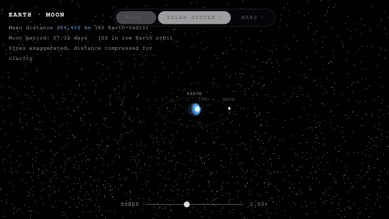

# Orbital Simulation

Physics-based orbital mechanics engine — 8 planets, mission planning, and a live 3D visualization driven by the same data.



**Skills demonstrated:** numerical integration (RK4), astrodynamics (vis-viva, Hohmann transfers, Tsiolkovsky rocket equation), layered Python architecture, 83-test suite validated against NASA/JPL reference values — zero external dependencies.

---

## Quick Start

```bash
git clone <repo-url>
cd "Orbital Simulation"
python3 main.py
```

No dependencies. Python 3 standard library only.

---

## What It Computes

- **Orbital velocity & period** — all 8 planets (JPL J2000.0 semi-major axes)
- **Earth systems** — ISS and Moon velocity, period, and escape velocity
- **Hohmann transfer Δv** — LEO→Moon and Earth→Mars maneuvers
- **Vis-viva velocity** — elliptical orbit speed at any point
- **Tsiolkovsky mass ratio** — propellant fraction from Δv and Isp
- **RK4 two-body propagator** — numerical trajectory integration (`propagator.py`)

---

## 3D Visualization

```bash
open solar_system.html        # macOS
xdg-open solar_system.html   # Linux
```

Or double-click `solar_system.html` in Finder. Requires internet (Three.js via CDN).

The animation uses the same JPL semi-major axes and Kepler velocities as the report engine — no separate dataset.

| Control | Action |
|---|---|
| Drag | Orbit camera |
| Scroll | Zoom |
| Right-drag | Pan |
| Speed slider | 0× pause → 6× fast-forward |

---

## Report Engine

```bash
python3 main.py                                          # full report, text
python3 main.py --section planets                        # one section
python3 main.py --format json --output report.json       # machine-readable
python3 main.py --format csv  --output report.csv
```

| Flag | Options |
|---|---|
| `--section` | `all` · `planets` · `earth` · `concepts` · `mars-base` · `transfers` |
| `--format` | `text` · `json` · `csv` |
| `--output` | file path — omit to print to stdout |

---

## Architecture

```
calculations.py   orbital velocity, period, escape velocity, vis-viva, Hohmann, Tsiolkovsky
constants.py      G, AU, SUN_MASS, EARTH_MASS, STANDARD_GRAVITY, ISS_ALTITUDE, …
data.py           planet and orbit datasets (JPL J2000.0)
propagator.py     RK4 two-body numerical integrator
report.py         record builder + text / JSON / CSV renderers
main.py           CLI entrypoint
solar_system.html 3D animation (Three.js, CDN)
tests/            83 tests across 5 modules
```

**Data flow:** `main.py` → `render_report()` → renderer → `collect_records()` → section builders → `calculations.py`

---

## Physics Reference

| Quantity | Formula | Unit |
|---|---|---|
| Orbital velocity | `v = √(GM / r)` | km/s |
| Orbital period | `T = 2π √(r³ / GM)` | hours |
| Escape velocity | `v_esc = √(2GM / r)` | km/s |
| Vis-viva | `v = √(GM (2/r − 1/a))` | km/s |
| Hohmann Δv | departure + arrival burns on transfer ellipse | km/s |
| Tsiolkovsky | `m₀/m_f = exp(Δv / (I_sp · g₀))` | — |

*G* = 6.67430 × 10⁻¹¹ m³ kg⁻¹ s⁻² (CODATA 2018) · *g₀* = 9.80665 m/s² (exact, BIPM)

---

## Data Sources

| Quantity | Source |
|---|---|
| Gravitational constant *G* | CODATA 2018 |
| Astronomical unit | IAU 2012 Resolution B2 |
| Solar mass | IAU 2015 Resolution B3 |
| Earth mass, radius, ISS altitude | NASA fact sheets (2024) |
| Planetary semi-major axes | JPL Horizons, epoch J2000.0 |
| Moon orbital radius | NASA Moon fact sheet (2024) |

---

## Assumptions

- Circular orbit approximation throughout — eccentricity and perturbations ignored
- Moon radius is the semi-major axis; actual range 356,500–406,700 km (e ≈ 0.0549)
- ISS altitude is a 2024-Q1 mean; decays ~2 km/year without reboosts
- Earth-Mars midpoint uses perihelion/aphelion heuristic, not a conjunction distance

---

## Testing

```bash
python3 -m unittest discover -s tests     # 83 tests
python3 -m unittest tests.test_calculations
```

Covers: physics functions · invalid input rejection · data integrity · JSON schema contract · CSV format · record counts · full pipeline · CLI routing · RK4 propagator.

---

<p align="center"></p>
